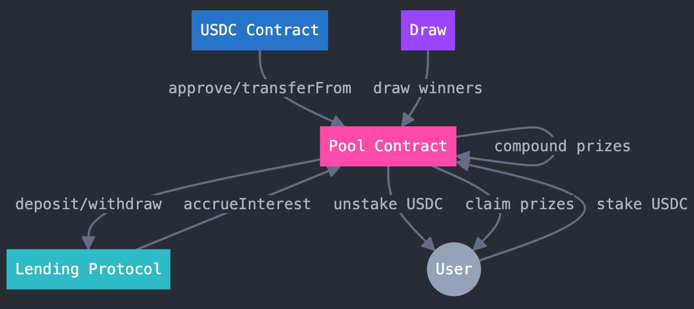

## What is Tontine?

Tontine is an application on MiniPay providing a new way of handling savings throught an incentivise pool, targeting emerging markets. It can also work with telegram miniapp. 
The App is deployed on the Celo blockhain.

## Why Tontine ?

In emerging countries like south asia or africa, people are struggling to save money and are prone to gambling addiction. We leverage the concept of "tontine" (a community shared piggy bank concept that is used in the real world to help communities share their wealth and have access to more utilities).
Billions of people face these hard challenges and Tontine will enables them to easily save money and benefit from the rewards.

## Deployed contracts

| Celo |
| :--: |

| [StakingPool](https://celoscan.io/address/0xAa65A85a674A54bBa3f3a11901b25b1c9150939E)

## Code Highlights

- [Staking Pool Contract](https://github.com/thibaultmthh/minilend/tree/main/hardhat)
- [Subgraph](https://github.com/thibaultmthh/minilend/tree/main/subgraph)
- [FrontEnd](https://github.com/thibaultmthh/minilend/tree/main/frontend)
- [BackEnd](https://github.com/thibaultmthh/minilend/tree/main/backend)
- [WebApp](https://tontine.money/)

## How it works

The user can stake cUSD into a pool contract that will deposit into a lending protocol (usually fork of aave). The Pool will accrue interest until a draw has been made and a random staker of the pool will be chosen to receive the reward (it is a weekly draw for now). 

At any point the user can unstake and use his cUSD to spend it, which means that the user never really "loses money" while having potential access to rewards.

We also created a system that allows recurring (monthly for now) deposit into the pool for the user. This is done throught a backend that is allowed to send metaTransactions for the wallet.

## Technical Stack 

- For Authentication we use Dynamic for embedded wallet and eoas
- We use Next for the front end and Node/Express for the back
- Hardhat for smart contracts deployments
- Celo as blockchain infrastructure
- Mini Pay and Telegram MiniApp for the app distribution
- MiniPay site tester and Celo-Composer MiniPay template starter kit

## Sponsor Feedback

The Graph:
- Celo is not publishable as a public subgraph on theGraph (but you can deploy your own graph)

Dynamic:
- Conflict between rainbowkit and dynamic 
- Integration difficulty with minipay celo app that slow development.
- It looks like dynamic sdks make next-server ( dev env) eating a lot of ram + slow it down.

Celo:
- It would be nice to have the minipay app integrated with IOS, half of our team was not able to test it.

## Context

This project was developed during the Devcon 2024 hackathon

